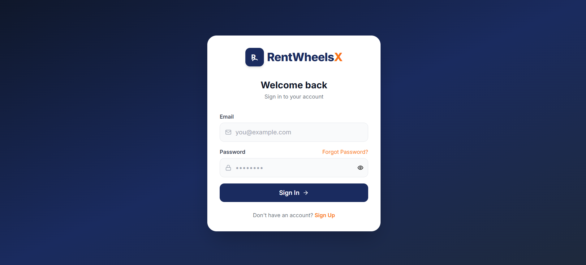
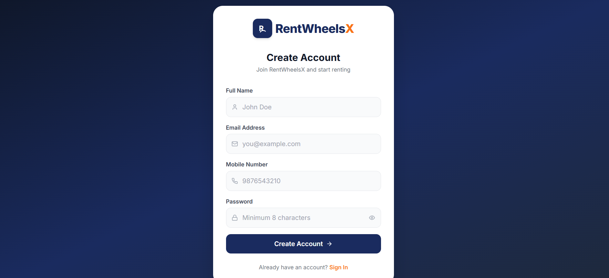
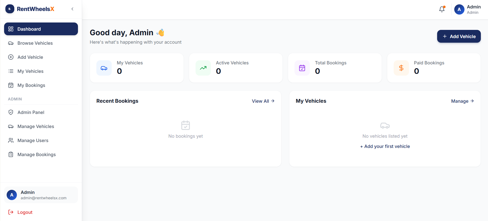
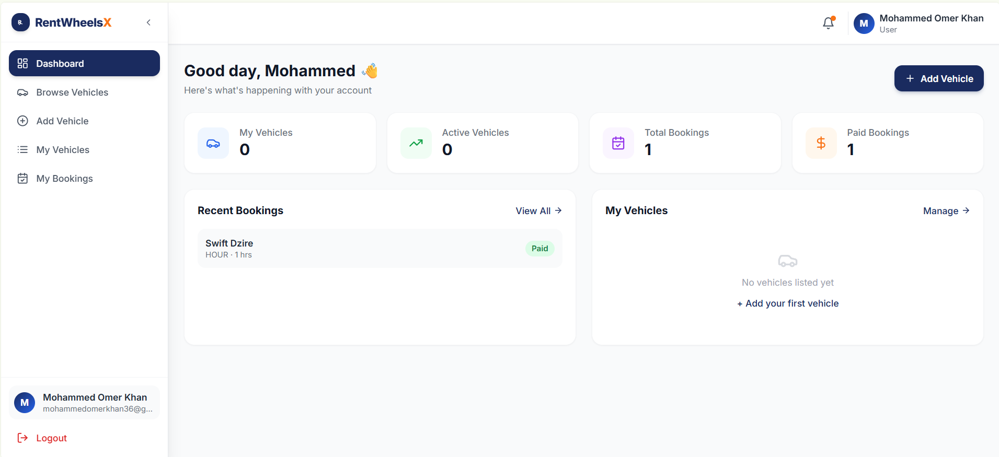
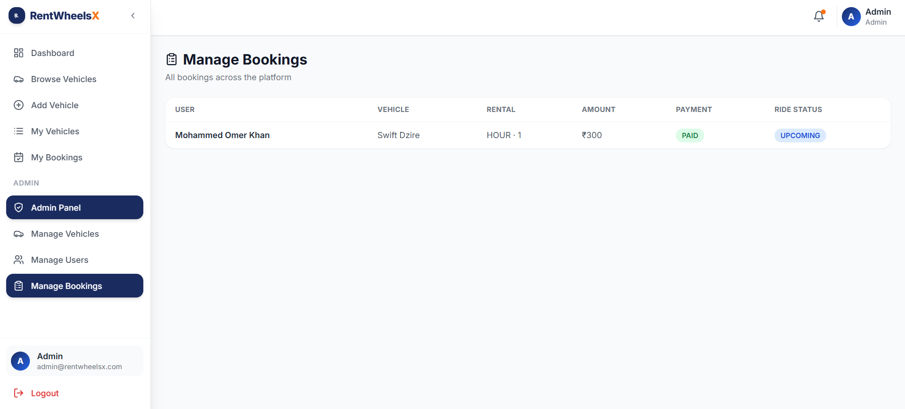
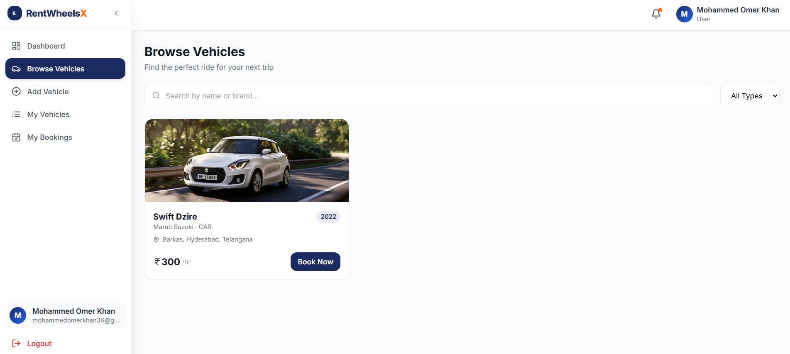

# 🚗 RentWheelsX – Vehicle Rental Platform

RentWheelsX is a full-stack vehicle rental platform that enables users to rent cars and bikes from vehicle owners. The application provides secure authentication, vehicle management, booking, payment simulation, KYC verification, and an admin approval workflow.

The project is built using **Java Spring Boot** for the backend and **React + Vite** for the frontend, following a REST API architecture with **JWT-based authentication** and **PostgreSQL hosted on Neon**.

---

# 📌 Features

## 👤 User Features

- User Registration with Email OTP Verification
- Resend OTP
- Secure Login using JWT Authentication
- Forgot Password
- Password Reset using Email OTP
- View Available Vehicles
- Search & Browse Vehicles
- Add New Vehicles
- Manage Own Vehicles
- Update Vehicle Details
- Delete Vehicles
- Activate / Deactivate Vehicle Listings
- Book Vehicles
- Payment Simulation
- View Booking History
- KYC Submission
- Owner Contact Details Revealed After Successful Payment

---

## 🛡️ Admin Features

- Secure Admin Login
- View All Registered Users
- View All Vehicles
- Approve Vehicle Listings
- Reject Vehicle Listings
- View All Bookings
- Monitor Platform Activity

---

# 🔒 Security Features

- Spring Security
- JWT Authentication
- Role-Based Authorization
- BCrypt Password Encryption
- Email OTP Verification
- Password Reset using OTP
- Protected REST APIs
- CORS Configuration
- Stateless Authentication

---

# 🛠️ Tech Stack

## Backend

- Java 17
- Spring Boot
- Spring Security
- Spring Data JPA
- Hibernate
- JWT
- Maven
- PostgreSQL

## Frontend

- React
- Vite
- Tailwind CSS
- Axios
- React Router DOM
- Lucide React

## Database

- PostgreSQL
- Neon PostgreSQL

## Email

- Mailjet SMTP
- HTML Email Templates
- OTP Verification
- Password Reset OTP

## Tools

- IntelliJ IDEA
- Visual Studio Code
- Postman
- Git
- GitHub

---

# 📂 Project Structure

```text
RentWheelsX/
│
├── rentwheelsx-backend/
│   ├── src/
│   ├── pom.xml
│   └── application.properties.example
│
├── rentwheelsx-frontend/
│   ├── src/
│   ├── package.json
│   └── vite.config.js
│
├── screenshots/
│   ├── login.png
│   ├── register.png
│   ├── admin_dashboard.png
│   ├── user_dashboard.png
│   ├── bookings.png
│   └── vehicles.png
│
└── README.md
```

---

# ⚙️ Installation

## Clone Repository

```bash
git clone https://github.com/themohammedomerkhan/RentWheelsX.git
cd RentWheelsX
```

---

# 🚀 Backend Setup

Navigate to the backend:

```bash
cd rentwheelsx-backend
```

Configure your database, JWT, and Mailjet credentials inside:

```text
src/main/resources/application.properties
```

Use:

```text
application.properties.example
```

as a reference.

Run the backend:

```bash
mvn spring-boot:run
```

> The backend is configured for deployment on Render. The local development configuration may use a different port depending on your `application.properties`.

---

# 💻 Frontend Setup

Navigate to the frontend:

```bash
cd rentwheelsx-frontend
```

Install dependencies:

```bash
npm install
```

Start the frontend:

```bash
npm run dev
```

The Vite development server normally runs on:

```text
http://localhost:5173
```

> The deployed frontend uses the deployed Render backend API.

---

# 🗄️ Database Configuration

RentWheelsX uses **PostgreSQL hosted on Neon**.

Configure the following properties inside `application.properties`:

```properties
spring.datasource.url=YOUR_DATABASE_URL
spring.datasource.username=YOUR_USERNAME
spring.datasource.password=YOUR_PASSWORD
spring.datasource.driver-class-name=org.postgresql.Driver
```

Hibernate automatically creates and updates the required database tables using:

```properties
spring.jpa.hibernate.ddl-auto=update
```

> ⚠️ Never commit your real database credentials, Mailjet credentials, or JWT secret to GitHub.

---

# 📧 Email Configuration

RentWheelsX uses **Mailjet SMTP** for sending transactional emails.

The application uses email for:

- User registration OTP
- OTP verification
- Resending OTP
- Forgot password OTP
- Password reset verification

Configure the SMTP settings inside `application.properties`:

```properties
spring.mail.host=in-v3.mailjet.com
spring.mail.port=587
spring.mail.username=YOUR_MAILJET_API_KEY
spring.mail.password=YOUR_MAILJET_SECRET_KEY
```

Use your **Mailjet API Key** as the SMTP username and your **Mailjet Secret Key** as the SMTP password.

> ⚠️ Never commit your Mailjet credentials to GitHub.

---

# 🔑 Default Admin Account

The application includes an admin account for administrative operations.

```text
Email: admin@rentwheelsx.com
Password: admin123
```

> ⚠️ For production deployment, use a secure admin password and never expose credentials publicly.

---

# 📡 REST APIs

The backend provides REST APIs for the following modules:

### Authentication

- Register
- Login
- Email OTP Verification
- Resend OTP
- Forgot Password
- Verify Password Reset OTP
- Reset Password
- Get User Profile
- KYC Submission

### Vehicles

- Add Vehicle
- Update Vehicle
- Delete Vehicle
- Activate / Deactivate Vehicle
- View All Vehicles
- View Vehicle by ID
- View Own Vehicles

### Booking

- Create Booking
- View Booking History
- View Booking by ID
- Payment Simulation
- Cancel Booking

### Admin

- View All Users
- View All Vehicles
- Approve Vehicle
- Reject Vehicle
- View All Bookings

---

# 🔄 Application Workflow

```text
User Registration
       │
       ▼
Email OTP Verification
       │
       ▼
User Login
       │
       ▼
JWT Authentication
       │
       ▼
Dashboard
       │
       ▼
Browse Vehicles
       │
       ▼
Add Vehicle
       │
       ▼
Admin Approval
       │
       ▼
Vehicle Available for Booking
       │
       ▼
Booking
       │
       ▼
Payment Simulation
       │
       ▼
Booking Completed
       │
       ▼
Owner Contact Details Revealed
```

---

# 🔐 Password Reset Workflow

```text
Forgot Password
       │
       ▼
Enter Registered Email
       │
       ▼
Password Reset OTP Sent
       │
       ▼
Verify OTP
       │
       ▼
Enter New Password
       │
       ▼
Password Updated
       │
       ▼
Login with New Password
```

---

# 📸 Screenshots

## 🔐 Login



---

## 📝 Registration



---

## 🛡️ Admin Dashboard



---

## 📊 User Dashboard



---

## 📅 Bookings



---

## 🚗 Vehicles



---

# 🧪 Testing

The application has been tested using:

- Postman
- Neon PostgreSQL
- React Frontend
- Spring Boot REST APIs

Major workflows tested:

- User Registration & Email OTP Verification
- User Login & JWT Authentication
- Forgot Password & Password Reset
- Vehicle Management
- Admin Vehicle Approval / Rejection
- Vehicle Booking
- Payment Simulation
- Booking Cancellation
- Admin Operations

---

# 🚀 Deployment

The application is deployed using:

- **Frontend:** Render
- **Backend:** Render
- **Database:** Neon PostgreSQL
- **Email Service:** Mailjet SMTP

### Live Application

https://rentwheelsx.onrender.com

### Backend API

https://rentwheelsx-backend.onrender.com

---

# 🌐 Deployment Architecture

```text
                  ┌─────────────────────┐
                  │      User Browser   │
                  └──────────┬──────────┘
                             │
                             ▼
                  ┌─────────────────────┐
                  │ React + Vite        │
                  │ Frontend - Render   │
                  └──────────┬──────────┘
                             │ REST API
                             │ JWT
                             ▼
                  ┌─────────────────────┐
                  │ Spring Boot Backend │
                  │ Backend - Render    │
                  └──────┬─────────┬────┘
                         │         │
                 ┌───────▼───┐ ┌──▼──────────┐
                 │ Neon      │ │ Mailjet SMTP│
                 │ PostgreSQL│ │ Email / OTP │
                 └───────────┘ └─────────────┘
```

---

# 🚀 Future Enhancements

- Real Payment Gateway Integration
- Google Maps Integration
- Vehicle Availability Calendar
- Reviews & Ratings
- Wishlist
- Push Notifications
- Advanced Search & Filtering
- Microservices Architecture

---

# 👨‍💻 Author

## Mohammed Omer Khan

- **GitHub:** https://github.com/themohammedomerkhan
- **LinkedIn:** https://www.linkedin.com/in/mohammed-omer-khan-workco/

---

# 📄 License

This project is licensed under the MIT License.
